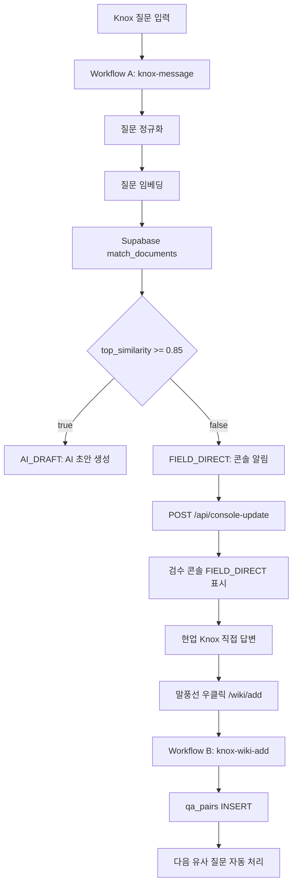

# Knox v2 구현 정리 및 n8n Scene 2 역설계 지침

작성일: 2026-05-16

## 1. 현재 구현 상태 요약

이번 작업은 `knox-v2-implementation_24b7ffbb.plan.md` 기준으로 프론트엔드와 로컬 Supabase migration 계약을 정리한 상태입니다. Supabase 원격 적용은 사용자의 지시에 따라 중단했으며, 지정 대상인 `https://scmlaiiypectfoboejam.supabase.co`에는 원격 SQL을 실행하지 않았습니다.

완료된 항목:

- `console/app/wiki/add/page.tsx`
  - 기존 브라우저 Supabase 직접 INSERT 제거.
  - 진입 시 Summarize Agent 호출 제거.
  - URL query string `text`, `author`, `time`, `chat`, `id` 수신.
  - 질문/답변/부서/태그 확인 후 `NEXT_PUBLIC_WIKI_WEBHOOK_URL`로 JSON POST.
  - 환경변수가 없으면 `https://wontaeryu.app.n8n.cloud/webhook-test/knox-wiki-add` 사용.

- `messenger/chat-room.jsx`
  - 말풍선 우클릭 메뉴의 "위키에 추가하기" 목적지를 legacy `wiki-add.html`에서 콘솔 배포 URL로 변경.
  - 최종 URL: `https://knock-knox-console.vercel.app/wiki/add?...`
  - 기존 query string 파라미터 `chat`, `author`, `time`, `text`, `id`는 유지.

- `messenger/data.jsx`
  - `PEOPLE.wontae` 추가.
  - `c_rookie` 채팅방에 Scene 2 시연용 AI 미응답 시스템 메시지와 류원태 직접 답변 메시지 추가.
  - 우클릭 시연 대상 메시지: `m_rookie_wontae_1`.

- `console/app/console/page.tsx`
  - `FIELD_DIRECT` 상세 패널 보강.
  - 최고 유사도, 임계값 `0.85`, 가장 가까운 과거 질문, Knox 우클릭 Wiki 적재 안내 표시.

- `supabase/migrations/001_init.sql`
  - 로컬 migration을 v2 계약에 맞게 정리.
  - `inquiries.id`는 `BIGSERIAL`.
  - `qa_pairs`는 `content`, `metadata`, `embedding VECTOR(1536)` 구조.
  - `match_documents` RPC, HNSW 인덱스, department 인덱스, Realtime publication, RLS 정책 포함.

보류된 항목:

- Supabase 원격 스키마 적용 및 원격 검증
  - 대상 프로젝트는 `scmlaiiypectfoboejam`이어야 합니다.
  - MCP 권한 문제로 원격 적용은 중단했습니다.
  - 원격 DB에는 사용자가 직접 SQL Editor로 적용하거나, Supabase CLI DB password 방식으로 적용해야 합니다.

- n8n Workflow B 실제 생성
  - 이번 범위에서 제외되었습니다.
  - 아래 지침은 현재 코드 구조를 기준으로 n8n에서 재구성하기 위한 설계입니다.

## 2. 현재 기능별 역할

### 2.1 Knox Messenger

파일:

- `messenger/data.jsx`
- `messenger/chat-room.jsx`

역할:

- `data.jsx`는 Knox 데모용 인물, 채팅방, 메시지, n8n Webhook URL 설정의 단일 소스입니다.
- `c_rookie`는 Scene 2, 즉 유사 질문을 찾지 못해 AI가 답변을 만들지 않고 현업 담당자가 직접 응대하는 시나리오입니다.
- 사용자가 류원태 답변 말풍선 `m_rookie_wontae_1`을 우클릭하면 `chat-room.jsx`가 다음 URL로 이동합니다.

```text
https://knock-knox-console.vercel.app/wiki/add
  ?chat={chat.title}
  &author={message author}
  &time={message time}
  &text={message text}
  &id={message id}
```

주의:

- 현재 `chat` 파라미터는 채팅방 ID가 아니라 `chat.title`입니다. 예: `김신입`.
- n8n Wiki 적재에서 실제 channel id가 필요하면 메신저 링크 생성부를 `chat.id`로 바꾸는 추가 결정이 필요합니다.

### 2.2 Console Wiki Add Page

파일:

- `console/app/wiki/add/page.tsx`

역할:

- Knox에서 전달받은 말풍선 내용을 확인하고 Wiki 적재용 질문/답변으로 편집합니다.
- 사용자가 최종 확인 버튼을 누르면 n8n `knox-wiki-add` Webhook으로 POST합니다.

현재 요청 Body:

```json
{
  "chat_text": "원본 말풍선 text",
  "question": "사용자가 편집한 질문",
  "answer": "사용자가 입력한 답변",
  "department": "선택한 부서",
  "responder_name": "author 파라미터",
  "tags": ["입력한 태그들"],
  "channel_id": "chat 파라미터",
  "message_id": "id 파라미터"
}
```

Webhook URL:

- 우선순위 1: `NEXT_PUBLIC_WIKI_WEBHOOK_URL`
- fallback: `https://wontaeryu.app.n8n.cloud/webhook-test/knox-wiki-add`

성공 기준:

- n8n Webhook 응답 HTTP status가 2xx이면 화면에 `Wiki에 추가되었습니다` 표시.
- 2xx가 아니거나 네트워크 오류이면 `추가 실패. 다시 시도해주세요` 표시.

### 2.3 Console Update API

파일:

- `console/app/api/console-update/route.ts`

역할:

- n8n Workflow A가 Scene 1/Scene 2 결과를 콘솔에 전달하는 API입니다.
- `x-console-secret` 헤더가 `CONSOLE_API_SECRET`과 일치해야 합니다.
- Supabase service role client로 `inquiries`에 INSERT합니다.
- Realtime 구독 중인 콘솔 화면에 새 row가 표시됩니다.

Action A `AI_DRAFT` 입력 계약:

```json
{
  "mode": "AI_DRAFT",
  "original_question": "질문 원문",
  "sender_name": "질문자 이름",
  "sender_dept": "질문자 부서",
  "channel_id": "Knox 채널 ID",
  "agent_response": {
    "draft": "AI 초안",
    "confidence": 0.91,
    "sources": [
      {
        "matched_question": "매칭된 과거 질문",
        "similarity": 0.91
      }
    ]
  }
}
```

Action B `FIELD_DIRECT` 입력 계약:

```json
{
  "mode": "FIELD_DIRECT",
  "original_question": "질문 원문",
  "sender_name": "질문자 이름",
  "sender_dept": "질문자 부서",
  "channel_id": "Knox 채널 ID",
  "top_similarity": 0.41,
  "top_match": "가장 가까운 과거 질문"
}
```

저장 매핑:

- `ai_draft`: Action A는 초안, Action B는 `null`.
- `ai_confidence`: Action A는 confidence, Action B는 top_similarity.
- `sources`: Action A는 sources 배열, Action B는 `[{ matched_question: top_match, similarity: top_similarity }]`.

### 2.4 Console Review UI

파일:

- `console/app/console/page.tsx`

역할:

- Supabase `inquiries` 최신 50건 조회.
- `inquiries` INSERT Realtime 구독.
- `AI_DRAFT`는 초안 검수 패널 표시.
- `FIELD_DIRECT`는 AI가 답변하지 않은 이유와 Knox 직접 응대 안내 표시.

Scene 2 표시 핵심:

- `mode === 'FIELD_DIRECT'`
- `ai_confidence`를 최고 유사도로 표시.
- `0.85`를 임계값으로 표시.
- `sources[0].matched_question`을 가장 가까운 과거 질문으로 표시.
- 담당자가 Knox에서 직접 답변한 뒤 말풍선을 우클릭하여 Wiki에 추가하도록 안내.

## 3. Supabase 스키마 계약

원격 적용은 아직 보류 상태입니다. 적용 대상은 반드시 `https://scmlaiiypectfoboejam.supabase.co`입니다.

필요 객체:

- `qa_pairs`
  - Q-Q RAG 지식베이스.
  - `content`: 정규화된 질문.
  - `metadata`: 답변, 부서, 태그, 응답자, 채널 등 부가 정보.
  - `embedding`: OpenAI `text-embedding-3-small` 기준 1536차원 vector.

- `match_documents`
  - n8n Supabase Vector Store 또는 직접 RPC에서 사용할 유사도 검색 함수.
  - 반환값: `id`, `content`, `metadata`, `similarity`.

- `inquiries`
  - 검수 콘솔 Realtime 구독 대상.
  - `console-update` API가 service role로 INSERT.
  - 콘솔 브라우저가 anon key로 SELECT 및 Realtime 구독.

RLS 정책:

- `qa_pairs`: anon SELECT 허용, service_role 쓰기 허용.
- `inquiries`: anon SELECT 허용, service_role 쓰기 허용.

원격 적용 전 확인 SQL:

```sql
SELECT table_name
FROM information_schema.tables
WHERE table_schema = 'public'
  AND table_name IN ('qa_pairs', 'inquiries');

SELECT routine_name
FROM information_schema.routines
WHERE routine_schema = 'public'
  AND routine_name = 'match_documents';
```

원격 적용 후 확인 SQL:

```sql
SELECT table_name
FROM information_schema.tables
WHERE table_schema = 'public'
  AND table_name IN ('qa_pairs', 'inquiries')
ORDER BY table_name;

SELECT routine_name
FROM information_schema.routines
WHERE routine_schema = 'public'
  AND routine_name = 'match_documents';

SELECT indexname
FROM pg_indexes
WHERE schemaname = 'public'
  AND tablename = 'qa_pairs'
ORDER BY indexname;

SELECT schemaname, tablename
FROM pg_publication_tables
WHERE pubname = 'supabase_realtime'
  AND schemaname = 'public'
  AND tablename = 'inquiries';
```

## 4. n8n Scene 2 필요 구조

Scene 2는 "유사 질문을 찾지 못한 질문을 현업 담당자에게 라우팅하고, 담당자의 직접 답변을 Wiki에 적재해서 다음 질문부터 자동 처리되게 만드는 플라이휠"입니다.

전체 흐름:



### 4.1 Workflow A: 기존 `knox-message`에서 Scene 2 분기

목표:

- 질문을 정규화하고 Q-Q 유사도 검색을 수행합니다.
- 최고 유사도가 `0.85` 미만이면 AI 답변 생성을 하지 않고 `FIELD_DIRECT`를 콘솔에 보냅니다.

필수 입력:

Knox 메신저에서 질문 전송 시 n8n으로 들어오는 값은 현재 `messenger/data.jsx`의 `KNOCK_CONFIG.sender`와 메시지 내용을 기준으로 구성되어야 합니다.

권장 내부 데이터:

```json
{
  "original_question": "Claude API 키는 어떻게 발급받나요?",
  "sender_name": "김신입",
  "sender_dept": "서비스개발팀",
  "channel_id": "c_rookie",
  "question_normalized": "Claude API 키 발급 방법",
  "top_similarity": 0.41,
  "top_match": "가장 가까운 과거 질문"
}
```

Scene 2 콘솔 알림 HTTP Request:

- Method: `POST`
- URL: `https://knock-knox-console.vercel.app/api/console-update`
- Header:

```text
x-console-secret: {CONSOLE_API_SECRET}
Content-Type: application/json
```

Body:

```json
{
  "mode": "FIELD_DIRECT",
  "original_question": "{{ $json.original_question }}",
  "sender_name": "{{ $json.sender_name }}",
  "sender_dept": "{{ $json.sender_dept }}",
  "channel_id": "{{ $json.channel_id }}",
  "top_similarity": "{{ $json.top_similarity }}",
  "top_match": "{{ $json.top_match }}"
}
```

주의:

- `top_similarity`는 숫자여야 합니다.
- `top_match`는 문자열이어야 합니다.
- `mode`는 정확히 `FIELD_DIRECT`여야 합니다.
- API는 `reason` 같은 추가 필드를 저장하지 않습니다.

### 4.2 Workflow B: 신규 `knox-wiki-add`

목표:

- `console/app/wiki/add/page.tsx`에서 POST한 질문/답변을 받아 `qa_pairs`에 벡터 포함 문서로 적재합니다.
- 이 적재가 완료되어야 이후 유사 질문에서 Scene 1 자동 초안 생성이 가능해집니다.

Webhook:

- Path: `knox-wiki-add`
- Method: `POST`
- Test URL: `https://wontaeryu.app.n8n.cloud/webhook-test/knox-wiki-add`
- Production URL: `https://wontaeryu.app.n8n.cloud/webhook/knox-wiki-add`

수신 Body:

```json
{
  "chat_text": "원본 말풍선 text",
  "question": "사용자가 편집한 질문",
  "answer": "사용자가 입력한 답변",
  "department": "모니모마케팅팀",
  "responder_name": "류원태",
  "tags": ["보안", "Claude", "API Key"],
  "channel_id": "김신입",
  "message_id": "m_rookie_wontae_1"
}
```

권장 노드 구조:

1. Webhook Trigger
   - POST `/knox-wiki-add`
   - Body를 그대로 받습니다.

2. Validation 또는 IF Node
   - `question`, `answer`, `department`가 비어 있으면 실패 응답.
   - `tags`가 배열이 아니면 빈 배열로 보정.

3. Summarize/Cleanup Agent
   - 역할은 최소화합니다.
   - 이미 사용자가 편집한 `question`, `answer`가 들어오므로 재작성하지 않습니다.
   - 권장 출력:

```json
{
  "question_normalized": "Claude API 키 발급 방법",
  "answer_clean": "Anthropic Console에서 발급받되, 사내 보안 정책상 IT보안팀 검토 후 사용해야 합니다.",
  "tags": ["Claude", "API Key", "보안검토"]
}
```

4. Set Node: metadata 조립
   - `content`에는 질문만 저장합니다.
   - 답변은 `metadata.answer_text`에 저장합니다.

권장 metadata:

```json
{
  "answer_text": "{{ $json.answer_clean || $('Webhook').item.json.answer }}",
  "question_original": "{{ $('Webhook').item.json.question }}",
  "chat_text": "{{ $('Webhook').item.json.chat_text }}",
  "department": "{{ $('Webhook').item.json.department }}",
  "responder_name": "{{ $('Webhook').item.json.responder_name }}",
  "tags": "{{ $json.tags }}",
  "channel_id": "{{ $('Webhook').item.json.channel_id }}",
  "message_id": "{{ $('Webhook').item.json.message_id }}",
  "archived_at": "{{ $now.toISO() }}",
  "source": "knox-wiki-add"
}
```

5. OpenAI Embeddings
   - Model: `text-embedding-3-small`
   - Input: `question_normalized`
   - Dimension: 1536

6. Supabase Vector Store Insert 또는 Supabase Insert
   - Table: `qa_pairs`
   - `content`: `question_normalized`
   - `metadata`: 위 Set Node의 metadata
   - `embedding`: OpenAI embedding 결과

7. Respond to Webhook
   - 성공:

```json
{
  "status": "ok",
  "message": "Wiki 적재 완료"
}
```

   - 실패:

```json
{
  "status": "error",
  "message": "Wiki 적재 실패"
}
```

## 5. Scene 2 통합 테스트 시나리오

1. Supabase 원격에 `qa_pairs`, `inquiries`, `match_documents`가 있는지 확인합니다.
2. 콘솔 `/console`을 열고 Realtime 상태가 연결되는지 확인합니다.
3. n8n Workflow A에서 유사도 `0.41` 같은 `FIELD_DIRECT` 케이스를 강제로 보냅니다.
4. `/api/console-update`가 `inquiries`에 row를 만들고 콘솔에 표시되는지 확인합니다.
5. Knox `c_rookie` 채팅방에서 류원태 답변 말풍선을 우클릭합니다.
6. `/wiki/add` 페이지가 열리고 원본 대화, 질문, 답변 입력 UI가 표시되는지 확인합니다.
7. 답변과 태그를 입력한 뒤 최종 확인을 누릅니다.
8. n8n Workflow B가 실행되고 `qa_pairs`에 embedding 포함 row가 들어가는지 확인합니다.
9. 같은 질문을 다시 입력했을 때 Workflow A의 Q-Q 검색 점수가 `0.85` 이상으로 올라가 Scene 1 `AI_DRAFT`로 전환되는지 확인합니다.

## 6. 현재 검증 결과

로컬 검증:

- `npm run typecheck`: 통과.
- `npm run build`: 통과.
- `node messenger/n8n-response.test.mjs`: 통과.
- IDE linter: 오류 없음.

제한:

- `npm run lint`는 ESLint 설정 파일이 없어 Next.js 초기 설정 프롬프트가 뜨며 중단됩니다. 코드 오류가 아니라 lint 설정 부재입니다.
- Supabase 원격 검증은 사용자가 중단을 요청했으므로 수행하지 않았습니다.

## 7. 남은 의사결정

- `channel_id`를 현재처럼 `chat.title`로 보낼지, 실제 `chat.id`로 바꿀지 결정해야 합니다.
- `NEXT_PUBLIC_WIKI_WEBHOOK_URL`을 Vercel Production/Preview 환경변수에 추가할지 결정해야 합니다. 현재 없으면 테스트 URL fallback을 사용합니다.
- n8n Workflow B를 테스트 URL로 먼저 구성할지, 운영 URL 활성 Workflow로 바로 구성할지 결정해야 합니다.
- Supabase 원격 적용은 반드시 `scmlaiiypectfoboejam` 프로젝트만 대상으로 진행해야 합니다.
